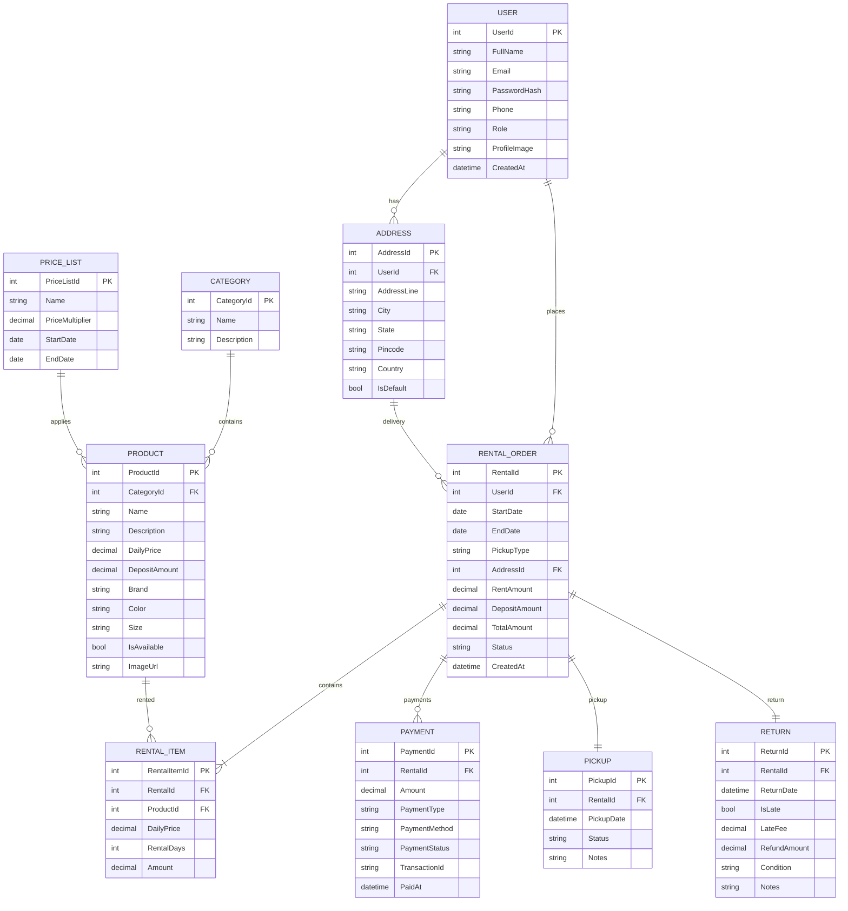

# Rental Management System

A full-stack rental management platform built during the **Odoo × KSV Hackathon 2026**.

## ✨ Features
- User authentication with JWT
- Product catalog and category management
- Rental booking workflow
- Payment simulation
- Pickup and return management
- Admin dashboard
- RESTful API
- PostgreSQL database
- Docker support

## 🛠️ Tech Stack

**Backend**
- ASP.NET Core
- Entity Framework Core
- PostgreSQL
- JWT Authentication
- Docker

**Frontend**
- React
- Vite
- Axios

## 📸 Screenshots


## 📖 API Documentation


# Base URL

```http
http://localhost:5000/api
```

---

# Authentication

## Register

```http
POST /api/auth/register
```

Request

```json
{
  "fullName": "John Doe",
  "email": "john@gmail.com",
  "password": "Password@123",
  "phone": "9876543210"
}
```

Response

```json
{
  "success": true,
  "message": "User registered successfully"
}
```

---

## Login

```http
POST /api/auth/login
```

Request

```json
{
  "email": "john@gmail.com",
  "password": "Password@123"
}
```

Response

```json
{
  "token": "jwt-token",
  "role": "Customer",
  "user": {
    "id": 1,
    "name": "John Doe",
    "email": "john@gmail.com"
  }
}
```

---

# Products

## Get Products

```http
GET /api/products
```

Response

```json
[
  {
    "id": 1,
    "name": "Dell Latitude",
    "imageUrl": "/images/laptop.png",
    "dailyPrice": 500,
    "deposit": 3000,
    "available": true
  }
]
```

---

## Product Details

```http
GET /api/products/{id}
```

Response

```json
{
  "id": 1,
  "name": "Dell Latitude",
  "description": "16GB RAM",
  "dailyPrice": 500,
  "deposit": 3000,
  "images": [
    "/images/1.png",
    "/images/2.png"
  ]
}
```

---

# Rental Booking

## Create Rental

```http
POST /api/rentals
```

Request

```json
{
  "productId": 1,
  "startDate": "2026-07-20",
  "endDate": "2026-07-23",
  "pickupType": "Store",
  "deliveryAddress": null
}
```

Response

```json
{
  "rentalId": 12,
  "rentAmount": 1500,
  "deposit": 3000,
  "totalAmount": 4500,
  "status": "Pending Payment"
}
```

---

# Payment

## Fake Payment

```http
POST /api/payments
```

Request

```json
{
  "rentalId": 12,
  "paymentMethod": "Card"
}
```

Response

```json
{
  "success": true,
  "invoiceNumber": "INV00012",
  "status": "Confirmed"
}
```

---

# Customer Rentals

## My Rentals

```http
GET /api/rentals/my
```

Response

```json
[
  {
    "id": 12,
    "product": "Dell Latitude",
    "startDate": "2026-07-20",
    "endDate": "2026-07-23",
    "status": "Reserved"
  }
]
```

---

# Admin

## Dashboard

```http
GET /api/admin/dashboard
```

Response

```json
{
  "activeRentals": 12,
  "upcomingPickups": 4,
  "upcomingReturns": 3,
  "overdue": 2,
  "revenue": 12000,
  "depositHeld": 15000,
  "lateFeeCollected": 1200
}
```

---

## Rental List

```http
GET /api/admin/rentals
```

Response

```json
[
  {
    "id": 12,
    "customer": "John",
    "product": "Dell Latitude",
    "status": "Reserved"
  }
]
```

---

# Pickup

## Confirm Pickup

```http
PUT /api/admin/rentals/{id}/pickup
```

Response

```json
{
  "success": true,
  "status": "Picked Up"
}
```

---

# Return Product

## Return

```http
PUT /api/admin/rentals/{id}/return
```

Request

```json
{
  "returnDate": "2026-07-24"
}
```

Response

```json
{
  "lateFee": 500,
  "deposit": 3000,
  "refund": 2500,
  "status": "Completed"
}
```

---

# Admin Product APIs

| Method | Endpoint                   | Purpose        |
| ------ | -------------------------- | -------------- |
| GET    | `/api/admin/products`      | List products  |
| POST   | `/api/admin/products`      | Add product    |
| PUT    | `/api/admin/products/{id}` | Edit product   |
| DELETE | `/api/admin/products/{id}` | Delete product |

---

# Frontend Pages → Backend APIs

| Frontend Page     | API                              |
| ----------------- | -------------------------------- |
| Login             | POST `/auth/login`               |
| Register          | POST `/auth/register`            |
| Home              | GET `/products`                  |
| Product Details   | GET `/products/{id}`             |
| Rent Product      | POST `/rentals`                  |
| Payment           | POST `/payments`                 |
| My Rentals        | GET `/rentals/my`                |
| Admin Dashboard   | GET `/admin/dashboard`           |
| Rental Management | GET `/admin/rentals`             |
| Pickup            | PUT `/admin/rentals/{id}/pickup` |
| Return            | PUT `/admin/rentals/{id}/return` |
| Product CRUD      | `/admin/products`                |

---

## Suggested Project Structure

### Frontend (React)

```
src/
 ├── pages/
 │    ├── Login
 │    ├── Register
 │    ├── Home
 │    ├── ProductDetails
 │    ├── Checkout
 │    ├── MyRentals
 │    ├── AdminDashboard
 │    ├── RentalManagement
 │    └── Products
 ├── services/
 │    └── api.js
 └── components/
```

### Backend (.NET Minimal API)

```
Endpoints/
    AuthEndpoints.cs
    ProductEndpoints.cs
    RentalEndpoints.cs
    PaymentEndpoints.cs
    DashboardEndpoints.cs

Services/
Repositories/
Models/
DTOs/
```

### Response Wrapper (recommended)

Have every endpoint return the same envelope so the frontend has a consistent contract:

```json
{
  "success": true,
  "message": "Success",
  "data": {}
}
```

For errors:

```json
{
  "success": false,
  "message": "Product not found",
  "errors": []
}
```

This consistent contract makes frontend integration much smoother and lets your teammate build with mocked responses before your backend is fully implemented.

## ER Diagram
For a **24-hour hackathon**, keep the database simple but extensible. This ER diagram covers everything required in the Odoo problem statement: authentication, rentals, deposits, payments, pickup/return, and admin management.



## Simplified Table Relationships

```text
User
 ├── Addresses
 └── Rental Orders
          │
          ├── Rental Items
          │      └── Product
          │              └── Category
          │
          ├── Payments
          ├── Pickup
          └── Return
```

## Hackathon-Friendly Notes

* **USER**: Both Admin and Customer (use a `Role` field instead of separate tables).
* **PRODUCT**: Store daily rental price and security deposit directly for simplicity.
* **RENTAL_ORDER**: Represents a customer's booking.
* **RENTAL_ITEM**: Allows future support for renting multiple products in one order.
* **PAYMENT**: Store both rental payment and security deposit using `PaymentType` (`Rental`, `Deposit`, `Refund`).
* **RETURN**: Holds late fee and refunded deposit information.
* **PRICE_LIST**: Optional; if time is short, you can skip this and use `DailyPrice` in `PRODUCT`.

### Recommended Implementation Priority

1. User
2. Product + Category
3. Rental Order
4. Rental Item
5. Payment
6. Pickup
7. Return
8. Price List (only if time permits)

This schema is normalized enough for a production-style design while remaining small enough for a 24-hour hackathon with React and .NET Minimal API.
For a **2-member team** in a **24-hour hackathon**, the best approach is to build **feature by feature**, where the frontend and backend work on the same module simultaneously.

---

# 🚀 Module 1: Project Setup (30 min)

### Backend (.NET)

* [ ] Create .NET Web API project
* [ ] Configure Entity Framework Core
* [ ] Configure SQL Server/SQLite
* [ ] JWT Authentication setup
* [ ] Swagger
* [ ] Global Exception Middleware
* [ ] Seed Admin user

### Frontend (React)

* [ ] Create React project (Vite)
* [ ] Install React Router
* [ ] Install Axios
* [ ] Setup Tailwind/Bootstrap
* [ ] Create API service
* [ ] Create common Layout
* [ ] Navbar
* [ ] Protected Routes

---

# 🔐 Module 2: Authentication

### Backend

* [x] User table
* [x] Register API
* [x] Login API
* [x] JWT Token generation
* [x] Password hashing
* [x] Role-based authorization

### Frontend

* [x] Login page
* [x] Register page
* [x] Form validation
* [x] Store JWT
* [x] Logout
* [x] Route protection
---

# 📦 Module 3: Product Management

### Backend

* [x] Product Entity
* [x] Category Entity
* [x] CRUD APIs
* [x] Product Images
* [x] Availability Status

### Frontend

* [x] Home page
* [x] Product Cards
* [x] Product Details page
* [x] Search
* [x] Category Filter
* [x] Product CRUD (Admin)

---

# 📅 Module 4: Rental Booking

### Backend

* [ ] Rental Order table
* [ ] Rental Item table
* [ ] Create Rental API
* [ ] Calculate rental days
* [ ] Calculate rent
* [ ] Calculate deposit

### Frontend

* [ ] Date picker
* [ ] Rental summary
* [ ] Checkout page
* [ ] Confirm booking
* [ ] Display price breakdown

---

# 💳 Module 5: Payment

### Backend

* [ ] Payment table
* [ ] Fake Payment API
* [ ] Invoice generation
* [ ] Update rental status

### Frontend

* [ ] Payment page
* [ ] Payment success page
* [ ] Invoice screen

---

# 📋 Module 6: My Rentals

### Backend

* [ ] Get My Rentals API
* [ ] Rental Details API

### Frontend

* [ ] My Rentals page
* [ ] Rental Detail page
* [ ] Status badge
* [ ] Invoice download button

---

# 🚚 Module 7: Pickup

### Backend

* [ ] Pickup table
* [ ] Pickup API
* [ ] Update rental status

### Frontend

* [ ] Pickup list (Admin)
* [ ] Pickup details
* [ ] Confirm Pickup button

---

# 🔄 Module 8: Return

### Backend

* [ ] Return table
* [ ] Return API
* [ ] Calculate late fee
* [ ] Deposit refund

### Frontend

* [ ] Return list
* [ ] Return form
* [ ] Refund summary
* [ ] Late fee display

---

# 📊 Module 9: Dashboard

### Backend

* [ ] Dashboard statistics API
* [ ] Revenue calculation
* [ ] Active rentals
* [ ] Upcoming pickups
* [ ] Upcoming returns
* [ ] Overdue rentals

### Frontend

* [ ] Dashboard cards
* [ ] Revenue chart (optional)
* [ ] Recent rentals
* [ ] Quick actions

---

# 👤 Module 10: User Profile

### Backend

* [ ] User profile API
* [ ] Update profile API

### Frontend

* [ ] Profile page
* [ ] Edit profile
* [ ] Address management

---

# ⚙️ Module 11: Admin Management

### Backend

* [ ] User List API
* [ ] Product Management APIs
* [ ] Rental Management APIs

### Frontend

* [ ] User Management
* [ ] Product Management
* [ ] Rental Management

---

# ⭐ Module 12: Bonus Features (If Time Allows)

### Backend

* [ ] Email notification
* [ ] QR Code generation
* [ ] PDF Invoice
* [ ] Wishlist

### Frontend

* [ ] QR display
* [ ] Notifications
* [ ] Dark mode
* [ ] Responsive improvements

---

# 🗂️ Recommended Development Order

| Phase      | Backend             | Frontend                  |
| ---------- | ------------------- | ------------------------- |
| ✅ Phase 1  | Project Setup       | Project Setup             |
| ✅ Phase 2  | Authentication APIs | Login/Register UI         |
| ✅ Phase 3  | Product APIs        | Product Listing & Details |
| ✅ Phase 4  | Rental APIs         | Booking & Checkout        |
| ✅ Phase 5  | Payment APIs        | Payment Flow              |
| ✅ Phase 6  | My Rentals APIs     | My Rentals UI             |
| ✅ Phase 7  | Pickup APIs         | Pickup Management         |
| ✅ Phase 8  | Return APIs         | Return Flow               |
| ✅ Phase 9  | Dashboard APIs      | Dashboard UI              |
| ⭐ Phase 10 | Admin APIs          | Admin Panels              |
| ⭐ Phase 11 | Bonus Features      | Bonus Features            |

## 🎯 Minimum Viable Product (MVP)

If time becomes tight, focus on completing these first:

* ✅ Authentication
* ✅ Product Catalog
* ✅ Rental Booking
* ✅ Payment (mock)
* ✅ My Rentals
* ✅ Pickup & Return
* ✅ Admin Dashboard
